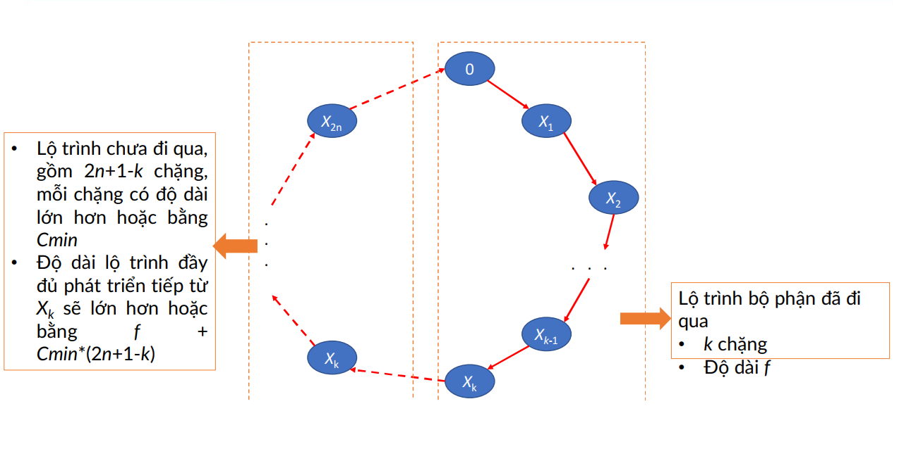

# The bus routing problem / Pickup & Delivery

- There are $n$ passengers $1, 2, …, n$. The passenger $i$ want to travel from point $i$ to point $i + n$.  And $(i = 1,2,…,n)$ 
- There is a bus located at point $0$ and has $k$ places for transporting the passengers (it means at any time, there are at most $k$ passengers on the bus). 
- You are given the distance matrix $c$ in which $c(i,j)$ is the traveling distance from point $i$ to point $j$. And $(i, j = 0,1,…, 2n)$. 
- Compute the shortest route for the bus, serving n passengers and coming back to point $0$. 

Input  
- Line 1 contains n and k (1≤n≤11,1≤k≤10)
- Line i+1 (i=1,2,…,2n+1) contains the (i−1)th
- Line of the matrix c (rows and columns are indexed from 0,1,2,..,2n).

Output
- Unique line contains the length of the shortest route.

Example  
Input  
```
3  2  
0  8  5  1  10  5  9
9  0  5  6  6  2  8
2  2  0  3  8  7  2
5  3  4  0  3  2  7
9  6  8  7  0  9  10
3  8  10  6  5  0  2
3  4  4  5  2  2  0
```

Output
```
25
```


Tham khảo:
- [ChatGPT](https://chatgpt.com/c/68f88ec3-9784-8322-9660-0da6d981f445)
- [Gemini](https://gemini.google.com/app/7300abb6b7cdcfcc)

## 🔹 Giải thích đề bài
Xe bắt đầu từ điểm 0 (depot), phải:
- Đón mỗi khách i tại điểm i (1 ≤ i ≤ n)
- Trả họ tại điểm i + n
- Không vượt quá sức chứa K
- Phải đón trước khi đến điểm trả khách
- Quay lại điểm 0 cuối cùng

→ tìm lộ trình ngắn nhất (chi phí tối thiểu).


## 🔹 Brand and bound

### Ý tưởng
- Vẫn là áp dụng thuật toán **Backtracking**
- Có thêm điều kiện cắt nhánh, dựa vào **cận dưới** nữa:
    - Tại mỗi nhánh, ta sẽ tính **tổng chi phí dự kiến ngắn nhất có thể** (f_estimate) (đây là cận dưới), rồi so sánh với **chi phí tốt nhất** (f_best) đã tìm được
    - Nếu **f_estimate** >= **f_best**, chứng tỏ các bước tiếp theo luôn tạo ra chi phí lớn hơn **phương án tốt nhất** => bỏ nhánh này


### Mô hình hóa
- `X1, X2, ..., X2n`: là dãy các điểm đón-trả trên lộ trình xe buýt (là hoán vị của 1, 2, ..., 2n)
- `c[i][j]`: chi phí từ điểm i → j. Trong đó: i, j = 0, 1, 2, ..., 2n
- `Cmin`: khoảng cách nhỏ nhất trong số các khoảng cách 2 điểm (giá trị nhỏ nhất khác 0 trong ma trận $c[i][j]$)
- `visited[v]`: đánh dấu điểm v đã xuất hiện trên lộ trình hay chưa (True: có, False: không)
- `load`: số khách đang có mặt trên xe. Khi lộ trình đi đến điểm đón thì load tăng lên 1, và khi đi đến điể mtrar thì load giảm đi 1
    - Trong khoảng 1 -> n: điểm đón
    - Trong khoảng n+1 -> 2n: điểm trả
- `f`: chi phí tạm thời (từ X[0] đến X[k])
- `f_best`: chi phí tốt nhất đã tìm được


<center>

  
Minh họa: Phân tích cận dưới
</center>


## 🔹 Minh họa với n = 3, k = 2
#### Ma trận chi phí
| From/To (i/j) | 0 | 1 | 2 | 3 | 4 | 5 | 6 |
|:---:|:---:|:---:|:---:|:---:|:---:|:---:|:---:|
| 0 | 0 | 8 | 5 | 1 | 10 | 5 | 9 |
| 1 | 9 | 0 | 5 | 6 | 6 | 2 | 8 |
| 2 | 2 | 2 | 0 | 3 | 8 | 7 | 2 |
| 3 | 5 | 3 | 4 | 0 | 3 | 2 | 7 |
| 4 | 9 | 6 | 8 | 7 | 0 | 9 | 10 |
| 5 | 3 | 8 | 10 | 6 | 5 | 0 | 2 |
| 6 | 3 | 4 | 4 | 5 | 2 | 2 | 0 |

#### Luồng
- Có 3 khách ⇒ tổng cộng 6 điểm (đón 1–3, trả 4–6).
- Xe xuất phát và kết thúc tại 0.
- Tải trọng tối đa K = 2.
- Mỗi hành trình là một hoán vị hợp lệ của [1..6] sao cho:
- Không trả khách trước khi đón.
- Không vượt quá tải.

| Biến         | Ý nghĩa                                                     |
| ------------ | ----------------------------------------------------------- |
| `n, K`       | số khách, sức chứa                                          |
| `c[i][j]`    | chi phí từ điểm `i` → `j`                                   |
| `X[k]`       | lộ trình đang xây dựng (điểm thứ `k`)                       |
| `visited[v]` | đánh dấu đã thăm điểm `v` hay chưa                          |
| `load`       | số khách đang ở trên xe                                     |
| `f`          | chi phí tạm thời (từ `X[0]` đến `X[k]`)                     |
| `f_best`     | chi phí tốt nhất đã tìm thấy                                |
| `Cmin`       | chi phí nhỏ nhất trong ma trận (dùng để ước lượng cận dưới) |

#### Tính toán sơ bộ
- Cmin = 1 (ví dụ: c[0][3] = 1).

#### Cây tìm kiếm (rút gọn ASCII)
Chỉ để tham khảo, đoạn f đang tính không đúng
```r
X[0] = 0
│
├─ X[1] = 1 (đón 1, load=1, f=8)
│   ├─ X[2] = 2 (đón 2, load=2, f=13)
│   │   ├─ X[3] = 4 (trả 1, load=1, f=14)
│   │   │   ├─ X[4] = 3 (đón 3, load=2, f=22)
│   │   │   │   ├─ X[5] = 5 (trả 2, load=1, f=30)
│   │   │   │   │   └─ X[6] = 6 (trả 3, load=0, f=25 + c[6][0]=25) ✅ f_best = 25
│   │   │   │   └─ X[5] = 6 (❌ trả 3 trước khi đón 3)
│   │   │   └─ X[4] = 5 (trả 2, load=0, f=20)
│   │   │       ├─ X[5] = 3 (đón 3, load=1, f=27)
│   │   │       │   └─ X[6] = 6 (trả 3, load=0, f=32 + c[6][0])
│   │   │       └─ X[5] = 6 (❌ trả 3 chưa đón)
│   │   └─ X[3] = 3 (❌ load=3 > K=2)
│   └─ X[2] = 3 (đón 3, load=2, f=13)
│       ├─ X[3] = 4 (trả 1, load=1, f=16)
│       │   ├─ X[4] = 2 (❌ đón 2 vượt K)
│       │   ├─ X[4] = 5 (❌ trả 2 chưa đón)
│       │   └─ X[4] = 6 (trả 3, load=0, f=22)
│       │       └─ ... (còn lại khách 2 chưa phục vụ)
│       └─ X[3] = 5 (❌ trả 2 chưa đón)
│
└─ X[1] = 2 (đón 2, load=1, f=5)
    ├─ X[2] = 1 (đón 1, load=2, f=13)
    │   ├─ X[3] = 4 (trả 1, load=1, f=14)
    │   │   ├─ X[4] = 3 (đón 3, load=2, f=22)
    │   │   │   ├─ X[5] = 5 (trả 2, load=1, f=30)
    │   │   │   │   └─ X[6] = 6 (trả 3, load=0, f=25 + c[6][0]=25) ✅ f_best = 25 (hoặc bằng nhánh trên)
    │   │   │   └─ ...
    │   │   └─ X[4] = 5 (trả 2, load=0, f=20)
    │   │       └─ ...
    │   └─ X[3] = 5 (trả 2, load=0, f=16)
    │       └─ ...
    └─ X[2] = 3 (đón 3, load=2, f=10)
        ├─ X[3] = 4 (❌ trả 1 chưa đón)
        ├─ X[3] = 5 (❌ trả 2 chưa đón)
        └─ X[3] = 6 (❌ trả 3 chưa đón)


```

#### Lộ trình tối ưu tìm được
```
[0, 3, 1, 4, 2, 6, 5]
Chi phí = 25
```