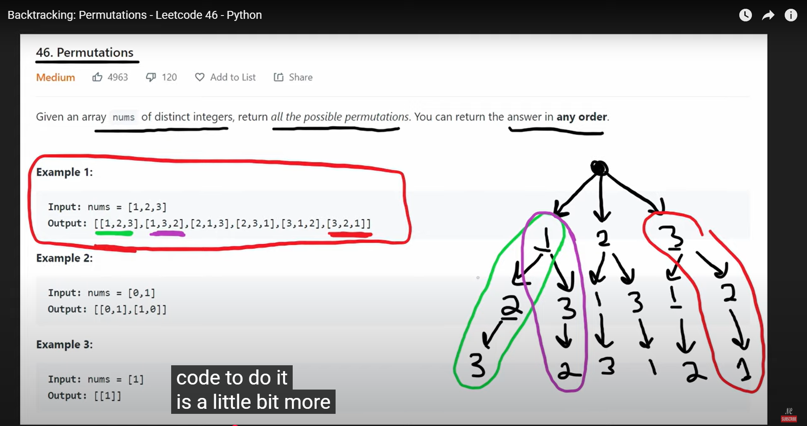

# Permutation generation

Given an integer n, write a program to generate all permutations of 1, 2, ..., n in a lexicalgraphic order (elements of a permutation are separated by a SPACE character).

## Example
- Input  
    3
- Output  
    1 2 3  
    1 3 2  
    2 1 3  
    2 3 1  
    3 1 2  
    3 2 1  

## 🌳 1. Backtracking
[permutation_generation.py](../src/permutation_generation.py)  
[Neetcode - Youtube](https://www.youtube.com/watch?v=s7AvT7cGdSo)  
[Leetcode - 46. Permutations](https://leetcode.com/problems/permutations/solutions/993970/python-4-approaches-visuals-time-complexity-analysis/)  
Giải thích: [ChatGPT](https://chatgpt.com/c/68f5bc49-7104-8321-a641-09c42ce0a006)  

[Neetcode](https://www.youtube.com/watch?v=s7AvT7cGdSo)

### Phân tích:
- Ta xây dựng dãy hoán vị dần dần, từ trái sang phải. 
- Tại mỗi bước: 
    1. Duyệt qua tất cả các số từ 1..n. 
    2. Nếu số chưa được chọn (used[i] = False) thì chọn nó (thêm vào dãy hiện tại). 
    3. Gọi đệ quy để xây tiếp phần còn lại. 
    4. Sau khi quay lui, bỏ chọn số đó để thử số khác. 
- Khi dãy đạt đủ n phần tử → in ra kết quả.  

Vì ta duyệt số theo thứ tự tăng dần từ 1 → n, nên kết quả sinh ra tự nhiên theo thứ tự từ điển. 

### ⏱️ Complexity:
- Time: O(n!)
- Space: O(n)

## 2. Iterative
[permutation_generation_v2.py](../src/permutation_generation_v2.py)
### Phân tích
- Tập {1, 2, …, n} có tổng cộng n! hoán vị.
- Lexicographic order nghĩa là sắp xếp các dãy giống như so sánh từ điển:
    + So sánh phần tử đầu tiên.
    + Nếu bằng nhau thì so tiếp phần tử thứ hai.
    + Cứ thế cho đến hết.
- Ví dụ với n=3:
    {1,2,3} < {1,3,2} vì ở vị trí thứ 2: 2 < 3.
    {2,1,3} < {2,3,1} vì ở vị trí thứ 2: 1 < 3.

### ⏱️ Complexity
- Time: O(n!)
- Space: O(n)

## 3. Dùng itertools.permutations của python
[permutation_generation_v3.py](../src/permutation_generation_v3.py)  
Viết bằng C, tối ưu vòng lặp và hạn chế overhead của Python.
### Phân tích
- Tập {1, 2, …, n} có tổng cộng n! hoán vị.
- Lexicographic order nghĩa là sắp xếp các dãy giống như so sánh từ điển:
    + So sánh phần tử đầu tiên.
    + Nếu bằng nhau thì so tiếp phần tử thứ hai.
    + Cứ thế cho đến hết.
- Ví dụ với n=3:
    {1,2,3} < {1,3,2} vì ở vị trí thứ 2: 2 < 3.
    {2,1,3} < {2,3,1} vì ở vị trí thứ 2: 1 < 3.

### ⏱️ Complexity
- Time: O(n!)
- Space: O(n)