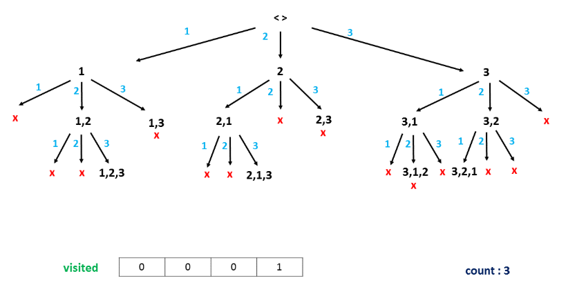

# Permutation with condition

Let the set N = {1, 2, 3, ..., n}. Each n-element permutation of the set N is represented by the array {a[1], a[2],..., a[n]}.   
An n-element permutation of the set N is perfect if each element a[i] (with i = 1, 2, .., n) in the permutation satisfies one of the following two conditions: 
- a[i] is divisible by i;
- i is divisible by a[i].

Input: a positive integer n (1 <= n <= 15).  
Output: Number of perfect permutations including n elements created from the set N = {1, 2, ..., n}.

#### Example 1:  
- Input: 1  
- Output: 1

#### Example 2:  
- Input: 5  
- Output: 10

<!-- ## More info
[Leetcode - 526. Beautiful Arrangement]() -->


## Tham khảo
- [Leetcode - 526. Beautiful Arrangement](https://leetcode.com/problems/beautiful-arrangement/description/)  
- [ChatGPT](https://chatgpt.com/c/68f70ee7-3df8-8321-92fd-df5ca86db3d3)


## 🌳 Backtracking

<center>

  
[Leetcode - 526. Beautiful Arrangement](https://leetcode.com/problems/beautiful-arrangement/description/)
</center>


### Ý tưởng
- Thuật toán sử dụng **đệ quy quay lui (backtracking)** để sinh ra tất cả các hoán vị có thể, nhưng chỉ mở rộng các nhánh hợp lệ tại từng bước (tức là thỏa mãn điều kiện chia hết nêu trên).
- Thay vì sinh ra toàn bộ `n!` hoán vị rồi mới kiểm tra, ta sẽ lọc ngay trong quá trình sinh – giúp loại bỏ sớm các nhánh sai (gọi là pruning).

=> Thuật toán dựa trên nguyên tắc: “Tại mỗi bước, chỉ chọn giá trị hợp lệ theo điều kiện chia hết, sau đó đệ quy cho vị trí tiếp theo.” Nhờ vậy, ta vừa đơn giản hóa logic, vừa tối ưu hóa thời gian chạy đáng kể so với sinh toàn bộ n! hoán vị.


### Hoạt động
Thuật toán định nghĩa hàm đệ quy **backtrack(i)**:
- `i` là vị trí hiện tại đang xét (từ 1 → n).
- Mảng `used[ai]` dùng để đánh dấu các số đã được sử dụng trong hoán vị.

#### Quy trình:
1. Nếu `i > n`: toàn bộ vị trí đã được gán hợp lệ → tăng biến đếm.
2. Duyệt qua tất cả các số `ai ∈ [1..n]`
3. Nếu `ai` chưa được dùng và thỏa `ai % i == 0 or i % ai == 0`, thì:
    - Đánh dấu `used[ai] = True`
    - Gọi đệ quy `backtrack(i + 1)`
    - Bỏ đánh dấu (quay lui): `used[ai] = False`


## ⏱️ Complexity
| Metric              | Complexity                                                       |
| :------------------ | :--------------------------------------------------------------- |
| Time                | **O(n!)** trong trường hợp xấu nhất (vì vẫn là sinh hoán vị), nhưng thực tế nhanh hơn nhiều nhờ loại bỏ sớm các nhánh sai. |
| Space               | **O(n)** cho mảng `used[]` và ngăn xếp đệ quy                            |
| Practical Limit     | Có thể chạy tốt cho `n ≤ 15`                                         |


## 🧪 Example
### n = 3
```
a1 = 1
 ├─ a2 = 2
 │   └─ a3 = 3 ✅ [1, 2, 3]
 └─ a2 = 3
     └─ a3 = 2 (❌)

a1 = 2
 ├─ a2 = 1
 │   └─ a3 = 3 ✅ [2, 1, 3]
 └─ a2 = 3
     └─ a3 = 1 (❌)

a1 = 3
 ├─ a2 = 1
 │   └─ a3 = 2 (❌)
 └─ a2 = 2
     └─ a3 = 1 ✅ [3, 2, 1]

```

✅ Tổng số hoán vị perfect: 2  
→ `[1, 2, 3], [2, 1, 3], [3, 2, 1]`

### n = 4
```
a1 = 1
 ├─ a2 = 2
 │   ├─ a3 = 3 (❌)
 │   └─ a3 = 4
 │        └─ a4 = 3 ✅ [1, 2, 4, 3]
 └─ a2 = 4
      ├─ a3 = 2
      │   └─ a4 = 3 ✅ [1, 4, 2, 3]
      ├─ a3 = 3
      │   └─ a4 = 2 ✅ [1, 4, 3, 2]
      └─ a3 = (❌)

a1 = 2
 ├─ a2 = 1
 │   ├─ a3 = 3
 │   │   └─ a4 = 4 ✅ [2, 1, 3, 4]
 │   └─ a3 = 4
 │        └─ a4 = 3 ✅ [2, 1, 4, 3]
 ├─ a2 = 3 (❌)
 └─ a2 = 4
      ├─ a3 = 1 (❌)
      └─ a3 = 3
           └─ a4 = 1 ✅ [2, 4, 3, 1]

a1 = 3
 ├─ a2 = 1
 │   └─ a3 = 2
 │        └─ a4 = 4 ✅ [3, 1, 2, 4]
 └─ a2 = 2
      └─ a3 = 4
           └─ a4 = 1 ✅ [3, 2, 4, 1]

a1 = 4
 ├─ a2 = 1
 │   ├─ a3 = 2 ✅ [4, 1, 2, 3]
 │   └─ a3 = 3 ✅ [4, 1, 3, 2]
 └─ a2 = 2
      └─ a3 = 3 ✅ [4, 2, 3, 1]
```

✅ Tổng số hoán vị perfect: 8  
→ `[1,2,4,3], [1,4,2,3], [1,4,3,2], [2,1,3,4], [2,1,4,3], [2,4,3,1], [3,1,2,4], [3,2,4,1], [4,1,2,3], [4,1,3,2], [4,2,3,1]`


### n = 5
```
a1 = 1
 ├─ a2 = 2
 │   ├─ a3 = 3 (❌)
 │   ├─ a3 = 4
 │   │   ├─ a4 = 3
 │   │   │   └─ a5 = 5 ✅ [1, 2, 4, 3, 5]
 │   │   └─ a4 = 5 ✅ [1, 2, 4, 5, 3]
 │   └─ a3 = 5
 │       └─ a4 = 4 ✅ [1, 2, 5, 4, 3]
 └─ a2 = 4
      ├─ a3 = 2
      │   ├─ a4 = 3
      │   │   └─ a5 = 5 ✅ [1, 4, 2, 3, 5]
      │   └─ a4 = 5 ✅ [1, 4, 2, 5, 3]
      ├─ a3 = 3
      │   └─ a4 = 2 ✅ [1, 4, 3, 2, 5]
      └─ a3 = 5 ✅ [1, 4, 5, 2, 3]

a1 = 2
 ├─ a2 = 1
 │   ├─ a3 = 3
 │   │   └─ a4 = 4
 │   │       └─ a5 = 5 ✅ [2, 1, 3, 4, 5]
 │   ├─ a3 = 4
 │   │   └─ a4 = 3 ✅ [2, 1, 4, 3, 5]
 │   └─ a3 = 5 ✅ [2, 1, 5, 4, 3]
 └─ a2 = 4
      ├─ a3 = 1
      │   └─ a4 = 3 ✅ [2, 4, 1, 3, 5]
      └─ a3 = 3
           └─ a4 = 5 ✅ [2, 4, 3, 5, 1]

a1 = 3
 ├─ a2 = 1
 │   ├─ a3 = 2
 │   │   └─ a4 = 4 ✅ [3, 1, 2, 4, 5]
 │   └─ a3 = 4 ✅ [3, 1, 4, 2, 5]
 └─ a2 = 2
      ├─ a3 = 4 ✅ [3, 2, 4, 1, 5]
      └─ a3 = 5 ✅ [3, 2, 5, 4, 1]

a1 = 4
 ├─ a2 = 1
 │   ├─ a3 = 2 ✅ [4, 1, 2, 3, 5]
 │   └─ a3 = 3 ✅ [4, 1, 3, 2, 5]
 └─ a2 = 2
      ├─ a3 = 3 ✅ [4, 2, 3, 1, 5]
      └─ a3 = 5 ✅ [4, 2, 5, 3, 1]

a1 = 5
 ├─ a2 = 1
 │   ├─ a3 = 2 ✅ [5, 1, 2, 3, 4]
 │   └─ a3 = 4 ✅ [5, 1, 4, 2, 3]
 └─ a2 = 2
      ├─ a3 = 4 ✅ [5, 2, 4, 3, 1]
      └─ a3 = 3 ✅ [5, 2, 3, 4, 1]
```
✅ Tổng số hoán vị perfect cho n=5: 10


## 📊 6. Kết quả tham khảo

|  n  | Perfect Permutations |
| :-: | :------------------: |
|  1  |           1          |
|  2  |           2          |
|  3  |           3          |
|  4  |          11          |
|  5  |          10          |
|  6  |          36          |
|  7  |          41          |
|  8  |          132         |
|  9  |          250         |
|  10 |          700         |
