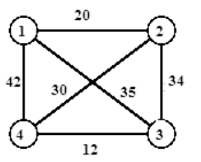

# Traveling Salesman Problem (TSP)
[Chapter 2. TSP](https://hustack.soict.ai/programming-contest/student-view-contest-problem-detail/20251ttudchbs/TSP)

There are n cities `1, 2, ..., n`. The travel distance from city `i` to city `j` is `c(i,j)`, for `i,j = 1, 2, ..., n`.  
A person departs from `city 1`, visits each `city 2, 3, ..., n` exactly **once** and **comes back** to `city 1`. Find the itinerary for that person so that the total travel distance is minimal.  

Input  
- Line 1: a positive integer n (1 <= n <= 20)  
- Line i+1 (i = 1, . . ., n): contains the ith row of the distance matrix x (elements are separated by a SPACE character)  

Output
- Write the total travel distance of the optimal itinerary found.

Example  
- Input:  
```
4  
0 1 1 9  
1 0 9 3  
1 9 0 2  
9 3 2 0  
```
- Output:  
```
7
```

## 🔍 Giải thích đề bài
- Có n thành phố, được đánh số 1, 2, …, n.
- Ma trận c[i][j] (kích thước n×n) cho biết khoảng cách từ thành phố i đến j.
- Người lữ hành:
    - Xuất phát từ thành phố 1 (index 0 trong code).
    - Đi qua tất cả các thành phố còn lại đúng một lần.
    - Cuối cùng quay lại thành phố 1.
- Mục tiêu: tìm tổng quãng đường nhỏ nhất có thể.


## 1️⃣ Brand and bound (Nhánh và cận)
### 1. Complexity
- Time: O(n!) ở trường hợp xấu nhất.

### 2. Ý tưởng

Vector nghiệm của bài toán là một dãy $(x_1=1, x_2, x_3, \ldots, x_n, x_{n+1}=1)$; với điều kiện giữa hai thành phố $x_i$ và $x_{i+1}$ phải có đường đi trực tiếp. Ngoài ra, chỉ có thành phố $1$ được phép lặp lại $2$ lần. Vì thế, có thể thấy dãy $(x_1, x_2, \ldots, x_n)$ là một hoán vị của $(1, 2, \ldots, n)$.

Ý tưởng duyệt quay lui như sau: Khi đã xây dựng được $(x_1, x_2, \ldots, x_i)$, thì $x_{i+1}$ có thể chọn một trong các thành phố mà có đường nối trực tiếp với nó, đồng thời chưa được chọn. Tuy nhiên, ta có thể áp dụng Nhánh và Cận để giảm độ phức tạp như sau:

Gọi chi phí tốt nhất hiện tại là $\text{best\_cost}$. Với mỗi bước thử chọn $x_i$, kiểm tra xem chi phí đường đi tính tới lúc đó có lớn hơn hoặc bằng chi phí tốt nhất hiện tại hay không. Nếu đã lớn hơn thì chọn ngay giá trị khác cho $x_i$, bởi vì có đi tiếp theo nhánh này cũng sẽ chỉ tạo ra chi phí lớn hơn mà thôi.

Tới khi chọn được một giá trị $x_n$ thì cần kiểm tra xem chi phí tới $x_n$ cộng thêm chi phí từ $x_n$ về $1$ có tốt hơn chi phí tốt nhất hiện tại không? Nếu có thì cập nhật lại cách đi tốt nhất.

<center>


</center>

Tham khảo thêm:
- [Viblo](https://viblo.asia/p/nhanh-va-can-branch-and-bound-Qbq5QBPEKD8)
- [ChatGPT](https://chatgpt.com/c/68f764ff-2814-8321-bccb-904c6bbe0fa5)

### 3. Ví dụ minh họa với n = 4
#### Ma trận chi phí $c[i][j]$:

| i → j   | 1  | 2  | 3  | 4  |
| ----- | -- | -- | -- | -- |
| **1** | 0  | 20 | 35 | 42 |
| **2** | 20 | 0  | 34 | 30 |
| **3** | 35 | 34 | 0  | 12 |
| **4** | 42 | 30 | 12 | 0  |

#### Cây tìm kiếm (ASCII minh họa)
```rust
Start at 1 (cost = 0)
|
|---> [2]  (+20)   --> current_cost = 20
|       |
|       |---> [3]  (+34)   --> 54
|       |       |
|       |       '---> [4]  (+12)   --> 66
|       |               |
|       |               '---> Back to [1] (+42) = 108 ✅ best_cost = 108
|       |
|       '---> [4]  (+30)   --> 50
|               |
|               '---> [3]  (+12)   --> 62
|                       |
|                       '---> Back to [1] (+35) = 97 ✅ new best
|
|---> [3]  (+35)   --> current_cost = 35
|       |
|       |---> [2]  (+34)   --> 69
|       |       |
|       |       '---> [4]  (+30)   --> 99
|       |               |
|       |               '---> Back to [1] (+42) = 141 ❌ (cut)
|       |
|       '---> [4]  (+12)   --> 47
|               |
|               '---> [2]  (+30)   --> 77
|                       |
|                       '---> Back to [1] (+20) = 97 ✅ equal best
|
'---> [4]  (+42)   --> current_cost = 42
        |
        |---> [2]  (+30)   --> 72
        |       |
        |       '---> [3]  (+34)   --> 106
        |               |
        |               '---> Back to [1] (+35) = 141 ❌ (cut)
        |
        '---> [3]  (+12)   --> 54
                |
                '---> [2]  (+34)   --> 88
                        |
                        '---> Back to [1] (+20) = 108 ❌ (cut)
```
#### Giải thích cây:
- Mỗi mức sâu tương ứng với việc chọn thêm 1 thành phố mới.
- Số trong ngoặc (+X) là chi phí di chuyển từ nút cha đến nút con.
- Số sau mũi tên --> là chi phí tích lũy tính đến nút đó.
- Khi đủ 4 thành phố, ta cộng chi phí quay lại 1.
- Những nhánh có dấu ❌ là bị cắt (bound) vì chi phí ≥ best_cost = 97.

#### Kết quả cuối cùng:
| Đường đi              | Tổng chi phí |
| --------------------- | ------------ |
| 1 → 2 → 3 → 4 → 1     | 108          |
| **1 → 2 → 4 → 3 → 1** | **97 ✅**     |
| 1 → 3 → 2 → 4 → 1     | 141          |
| **1 → 3 → 4 → 2 → 1** | **97 ✅**     |
| 1 → 4 → 2 → 3 → 1     | 141          |
| 1 → 4 → 3 → 2 → 1     | 108          |


## 2️⃣ Brand and bound - có cận dưới (lower bound)
Nhược điểm của Phiên bản 1 (không có cận dưới)
- Vẫn phải duyệt toàn bộ cây tìm kiếm — tức là thử n! hành trình.
- Dù biết rằng một nhánh đang đi chắc chắn tệ hơn kết quả tốt nhất hiện có, ta vẫn duyệt hết.

### Ý tưởng
- Thay vì chỉ kiểm tra if current_cost >= best_cost, ta ước lượng “chi phí tối thiểu có thể có” (Lower Bound) cho nhánh hiện tại.
- Nếu Lower Bound ≥ best_cost ⇒ nhánh này không thể tạo ra kết quả tốt hơn → cắt tỉa (prune).

### Cách tính Lower bound của nhánh hiện tại
```r
LB = current_cost 
     + sum(chi phí rẻ nhất đi ra từ các thành phố CHƯA ĐI)
     + chi phí rẻ nhất để QUAY LẠI thành phố 1
```

## 3️⃣ Dynamic Programming (Bitmask DP)
More info: [ChatGPT](https://chatgpt.com/c/68f74b31-12e0-8320-a42d-d6c8b9dc5c6f)
### 1. Complexity
- Số trạng thái: n * 2^n
- Mỗi trạng thái xét n lần → O(n^2 * 2^n)
- Với n ≤ 20, đây là tối ưu nhất có thể cho TSP (dùng DP Bitmask).

### 2. Ý tưởng
Ta định nghĩa: `dp[mask][i] = chi phí nhỏ nhất để đi qua tất cả các thành phố trong tập 'mask' và kết thúc ở thành phố i.`

#### Trạng thái:
- mask là bitmask biểu diễn các thành phố đã thăm.
- Nếu bit thứ j của mask = 1 → đã thăm thành phố j.
- Tổng số trạng thái mask = 2^n.
- i là thành phố cuối cùng đã thăm.

#### Công thức chuyển trạng thái:
Giả sử ta đang ở dp[mask][i], nghĩa là đã đi qua các thành phố trong mask và kết thúc tại i.  
Ta có thể đi tiếp đến thành phố j (chưa thăm):

```python
newmask = mask | (1 << j)
dp[newmask][j] = min(dp[newmask][j], dp[mask][i] + c[i][j])
```

#### Khởi tạo:
Bắt đầu từ thành phố 0 (city 1 trong đề): `dp[1][0] = 0`

#### Kết quả cuối cùng:
Sau khi đã đi qua tất cả các thành phố, `mask = (1 << n) - 1`, ta quay lại thành phố 0:
```python
ans = min(dp[full][i] + c[i][0]) for i in range(n)
```

### 3. Tóm tắt luồng chạy chương trình
- Đọc n và ma trận c.
- Khởi tạo dp[mask][i] = INF.
- Đặt dp[1][0] = 0.
- Với mỗi mask, mỗi i trong mask, thử đi đến các j chưa thăm.
- Cập nhật dp[newmask][j].
- Khi mask = full (đã đi qua hết), tính dp[full][i] + c[i][0].
- In ra kết quả nhỏ nhất.


### 4. Ví dụ minh họa
#### Input: Với n = 4
```
4
0 1 1 9
1 0 9 3
1 9 0 2
9 3 2 0
```

#### Ma trận khoảng cách
| i/j   | 1 | 2 | 3 | 4 |
| ----- | - | - | - | - |
| **1** | 0 | 1 | 1 | 9 |
| **2** | 1 | 0 | 9 | 3 |
| **3** | 1 | 9 | 0 | 2 |
| **4** | 9 | 3 | 2 | 0 |

#### Cách duyệt:
- Xuất phát từ 1 → {2, 3, 4} (theo mọi hoán vị có thể)
- Tính tổng chi phí từng hành trình:
    - **(1 → 2 → 4 → 3 → 1)** `=` **(1 + 3 + 2 + 1)** `=` **7**
    - **(1 → 3 → 4 → 2 → 1)** `=` **(1 + 2 + 3 + 1)** `=` **7**
    - Các cách khác đều > 7  
    → Kết quả: 7